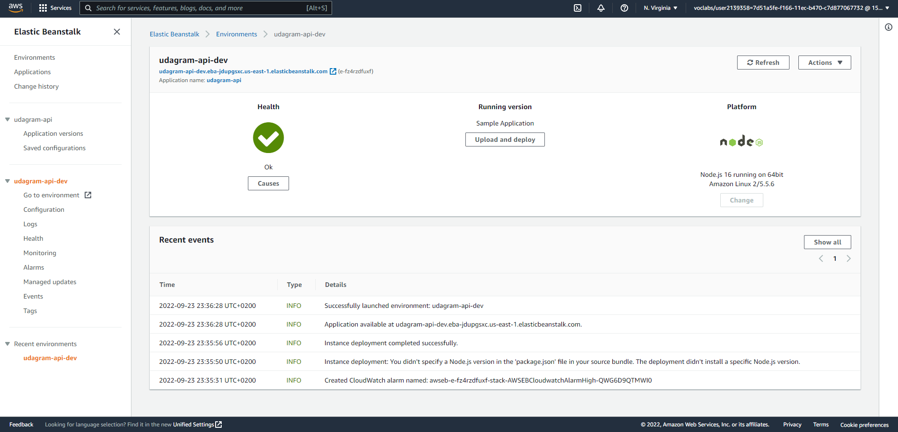
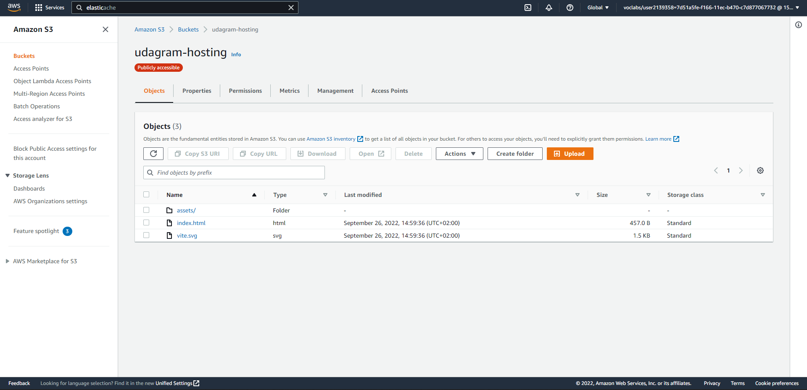
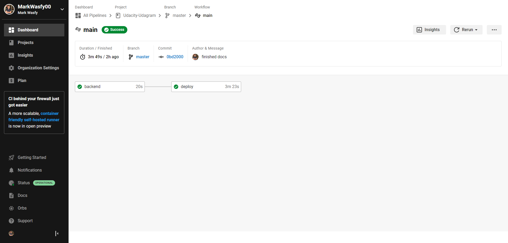
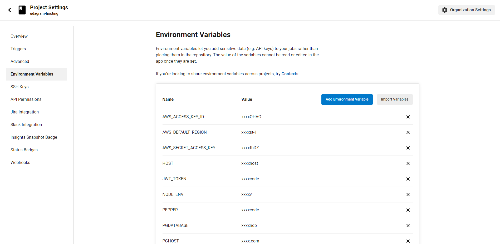
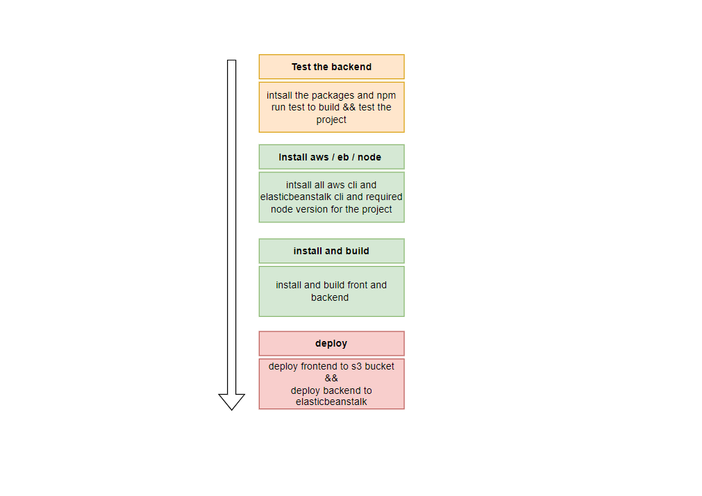
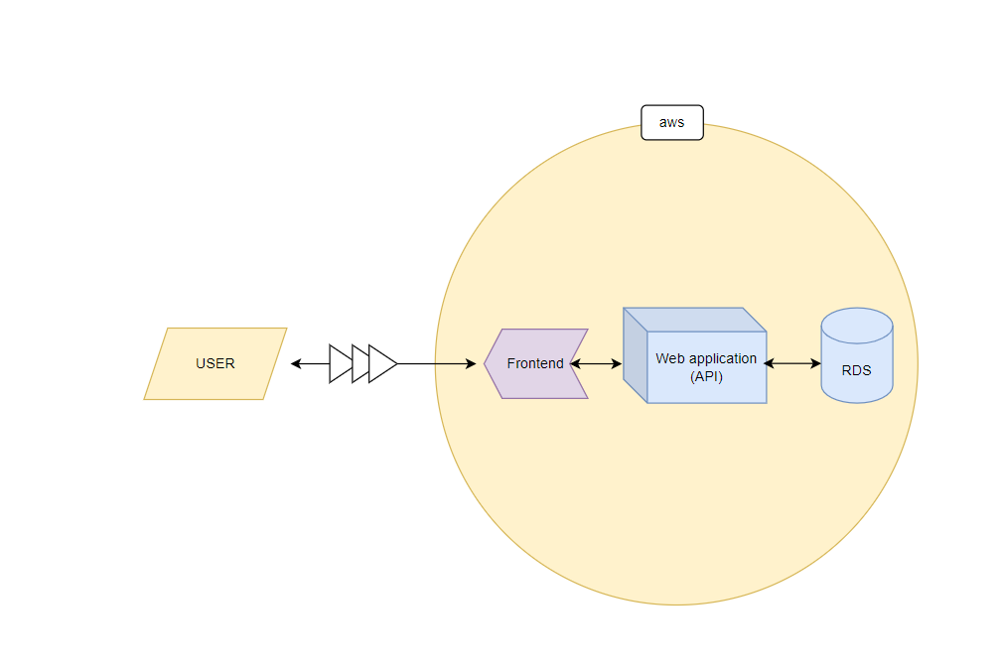

### Hosting a web application at aws

this was the storefront app from last project , I used it in hosting , added the login and register functionality to frontend uses jwt tokens

backend url : `http://udagram-api-dev.eba-jdupgsxc.us-east-1.elasticbeanstalk.com`
frontend url : `http://udagram-hosting.s3-website.us-east-2.amazonaws.com`

### Screenshots

#### EB Console

approve that eb console is working without any errors

#### RDS Console

approve that rds console is working without any errors

#### S3 Bucket Console

approve that s3 console is working without any errors

#### circleci

approve that circleci is working without any errors

#### Schema

#### Architecture

### This App Built With

- express (backend api)
- vite - react (frontend)
- node (excuter)
