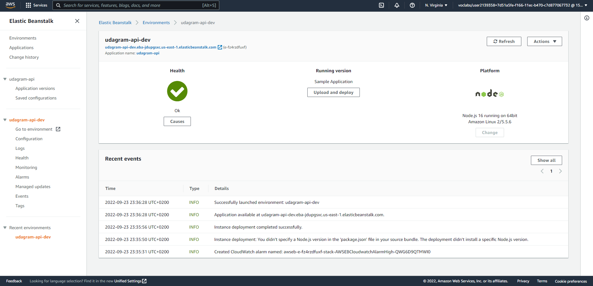
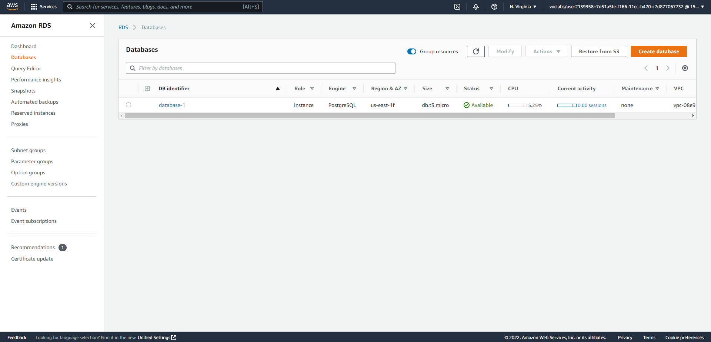
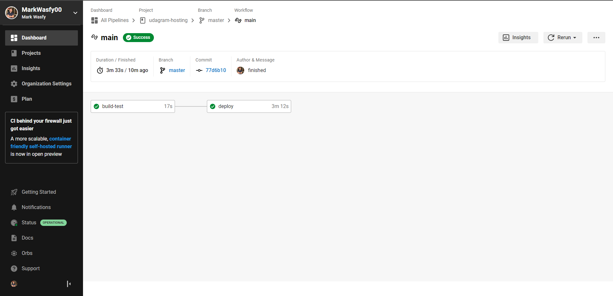
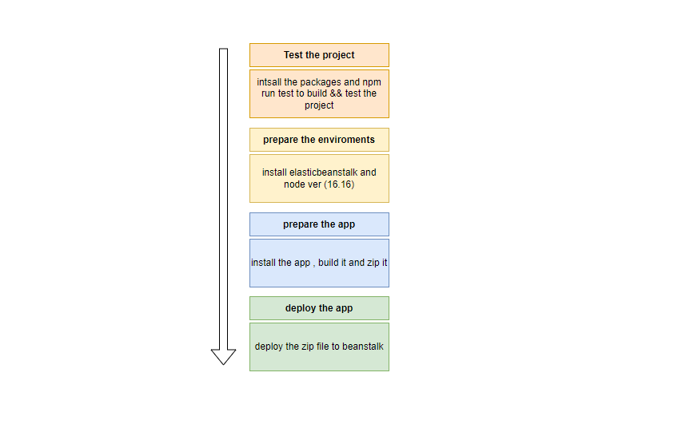
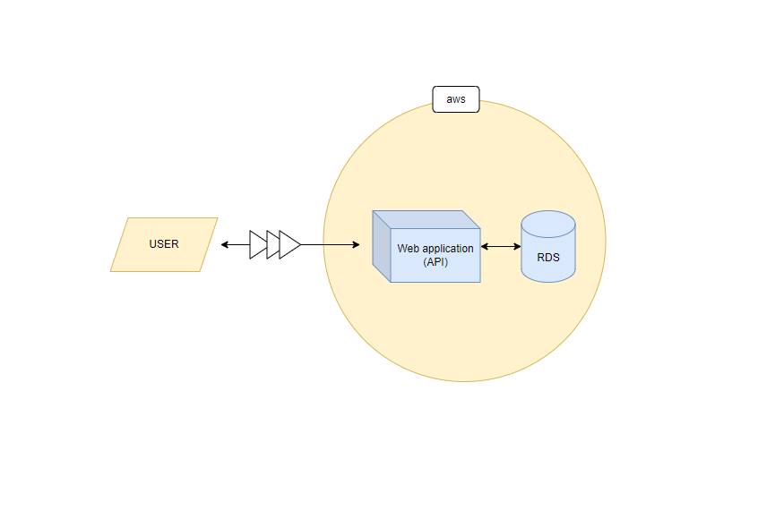

### Hosting a web application at aws

this was the storefront app from last project , I used it in hosting , it doesn't contain any frontend in this project i used RDS , EB , and circleci to host my project 

visit my app at : `http://udagram-api-dev.eba-jdupgsxc.us-east-1.elasticbeanstalk.com`
how to use this app at : `https://github.com/MarkWasfy00/Udacity-Storefront-Backend-Api`

### Screenshots

#### EB Console

approve that eb console is working without any errors

#### RDS Console

approve that rds console is working without any errors

#### circleci

approve that circleci is working without any errors

#### Schema

#### Architecture

### This App Built With

- express (backend api)
- node (excuter)
